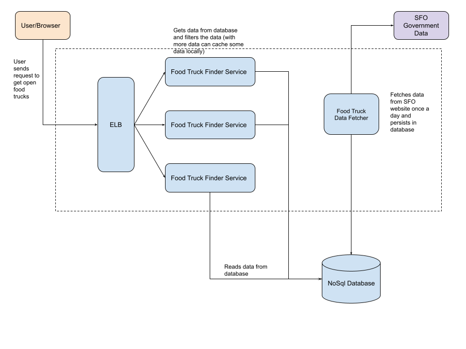

# Developer Guide
Here are the steps to run the application. You need internet connection to run this application. 
You need command line jdk installed.

- Download the zip file from google drive.
- Unzip `RedfinProject.zip` or clone it from [Github](https://github.com/tarun201288/RedfinProject)
- In the terminal, change directory to the RedfinProject directory. `cd /RedfinProject`
- Run the application using. `./gradlew run`. This will download Gradle 6.7 and run the application. 
  If you don't have command line jdk, please install before you can run the application.
- Optional Step: `./gradlew clean build` builds the application.  
- The application will show a page view and will take user input `next`.

# RedfinProject

This project provides the name and address of all the food trucks provided by San Francisco government’s
[website](https://data.sfgov.org/Economy-and-Community/Mobile-Food-Schedule/jjew-r69b) that are open currently.
Here are the steps this project takes to get that data:
- Fetch the data from San Francisco government website
- Filter the data to find open restaurants at the current time when the project is running.
- Show food truck names in alphabetical order

### Project Assumptions

- All comparison is done in Pacific Time because the data is in San Francisco. So, if the user is running this 
  application in a different time zone, the list will show the open restaurants in Pacific Time Zone by converting 
  the user current time to pacific time. This will help us be protected from DST (Daylight Saving) changes.
- The starttime and endtime provided on the data returned from the website is considered as the open and close time 
  for the food truck.
- Also, the token used to make the connection would not expire and can handle the rate expected from this application.

### Time Complexity

After fetching the data, To filter and print
Time complexity: O(n), where n is the number of food truck lists fetched on a particular day.
Space Complexity: O(k), where k is the number of open food truck (after filtering)

Apart from this the project saves some constant data that is again memory consumption.

### Improvements
This section will provide information on what can be improved about the application.

- If the program is run multiple times then it will create multiple objects for the service and the client, which 
  can be improved by dependency injection in a spring or guice application.
- The time zone is currently fixed and if the program is made open to other location outside California the code will
  have to be modified.
- The app token can be more secure and be provided through a config file so that it can be different for a dev or 
  a production environment.
  

## Architecture (Scaling)

- I will create a spring based gradlew web application. Users will see a paginated tabular data.
- User (browser) will connect to backend gateway (or api), which will first authenticate the user. If this information 
  needs to be public so we don't need to authenticate users.
- We would need a new api token that can handle our new rate.  
- Depending upon how frequently the data is updated within a day for Socrata, if it is not that frequent then we can 
  persist the data locally and can pull the data only once during the day and save our client calls which are expensive.
- For persisting data locally, a relational databases can be used because in the beginning it is just covering California
  food trucks. If the service is expanded to other states a nosql data can be more useful depending upon how much data are
  we expecting.
- If some states are requested more than the others, their information can be cached locally on the api gateway.

As I can see the data has location details as well, we can add more filters based on location so that user gets information
about the food trucks that are within like 10 miles of the user. 
We can also take the radius input from the user for him to get a better user experience.

Please look at a very high level design document below.

